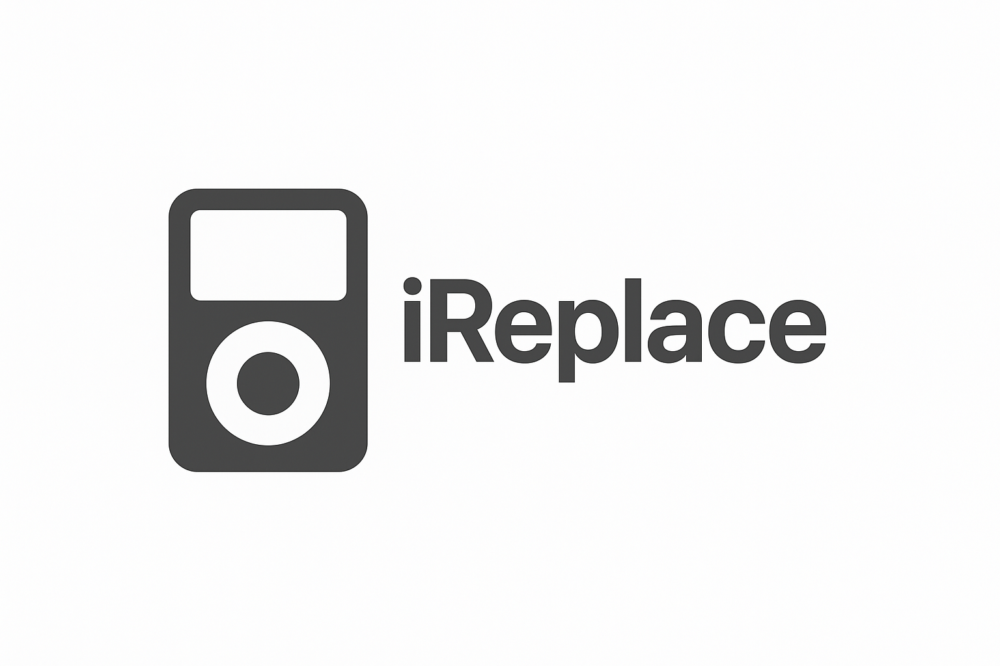

# iReplace™
iReplace™ is an open-source project that reimagines the iPod experience for today. It comes in two distinct versions:

iReplace™ Classic – a drop-in replacement that’s almost fully compatible with original iPod hardware. It’s designed for those who want to restore their existing devices while keeping the authentic internals and look of the classic iPod.

iReplace™ – a complete modern recreation built entirely from new, readily available components. It delivers the feel and functionality of the original iPod without relying on scarce or expensive vintage parts.

Together, these projects make it possible to repair, rebuild, or reinvent the iPod experience for the modern era.

___

© Adam Kirby 2025 - Present Day. All rights reserved.

This project, in its entirety, is claimed as a copyrighted work. While individual components, symbols, schematic elements, or other parts included in this design may be owned by others or be in the public domain, the overall design, structure, and presentation of this project is copyrighted.

iReplace™ is a trademark of Adam Kirby.
